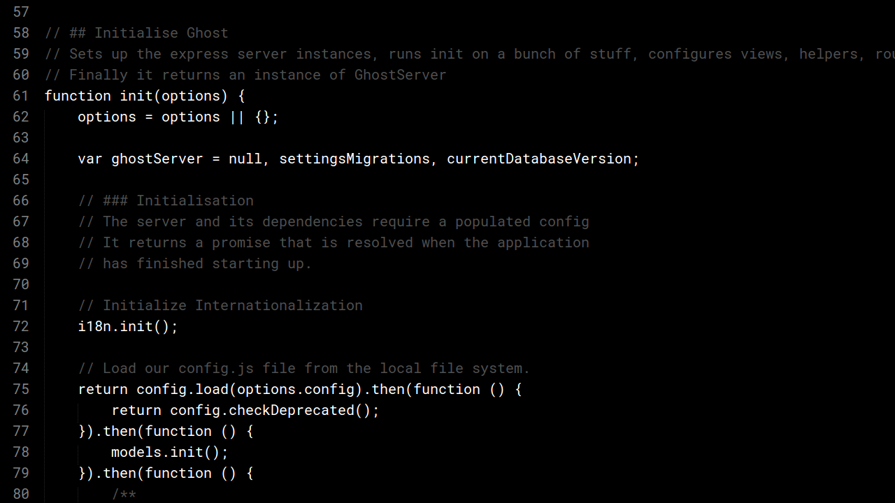
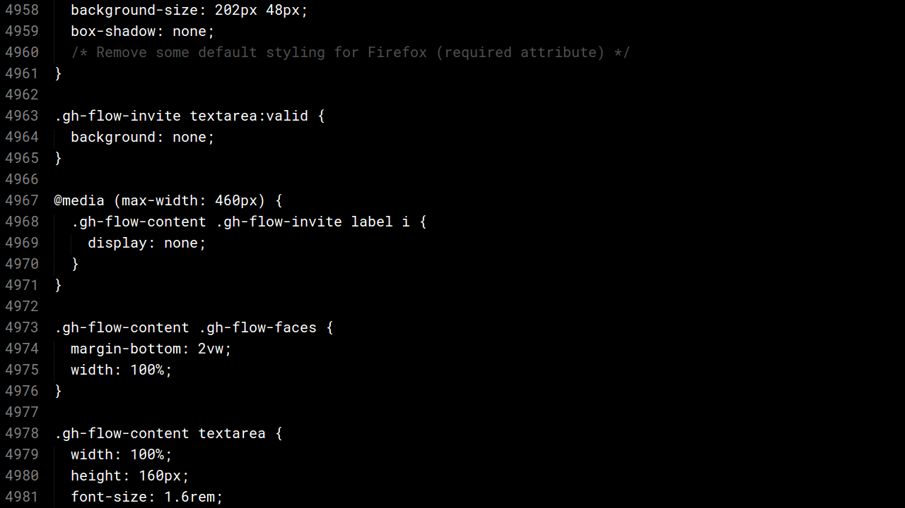

> A Sublime Text 3 theme

* [Screenshots](#screenshots)
* [Installation](#installation)
* [Credits](#credits)

## Screenshots

JavaScript

CSS

You got it... It's black background, white text, gray comments.

## Installation

### Install with [Package Control](https://packagecontrol.io/)

* Open the `Command Palette` (<kbd>CMD</kbd>+<kbd>MAJ</kbd>+<kbd>P</kbd>)
* Select `Package Control: Install Package`
* Search `All Black Color Scheme` and hit <kbd>Enter</kbd>

## Activation

* `Sublime Text` → `Preferences` → `Color Scheme` → `User` → `Color Highlighter` → `themes` → `All Black`

Then, restart Sublime Text.

## Credits

This theme was generated by: [TmTheme-Editor](http://tmtheme-editor.herokuapp.com)